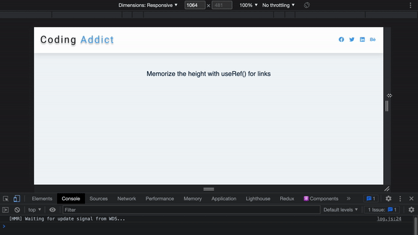

## Summary

Memorize the height with `useRef()` for links

[Live Demo](https://christy313.github.io/react15-project11/)



## Note

1. Memorize the height with `useRef()` for links when the screen is under 800px

Another solution: set CSS `height: auto;`

2. Check null of using `useRef()` 

`TypeError: Cannot read property 'getBoundingClientRect' of null`

```javascript
const linksContainerRef = useRef(null);
const linksRef = useRef(null);

if (!linksRef.current) return;
```
Ref: [TypeError: Cannot read property 'getBoundingClientRect' of null](https://stackoverflow.com/questions/61417274/typeerror-cannot-read-property-getboundingclientrect-of-null)

## File structure

```
.
└── src
    ├── App.js
    ├── Navbar.js
    ├── data.js
    ├── index.css
    ├── index.js
    └── logo.svg
```

## Available Scripts

In the project directory, you can run:

### `npm start`

Runs the app in the development mode.\
Open [http://localhost:3000](http://localhost:3000) to view it in your browser.
